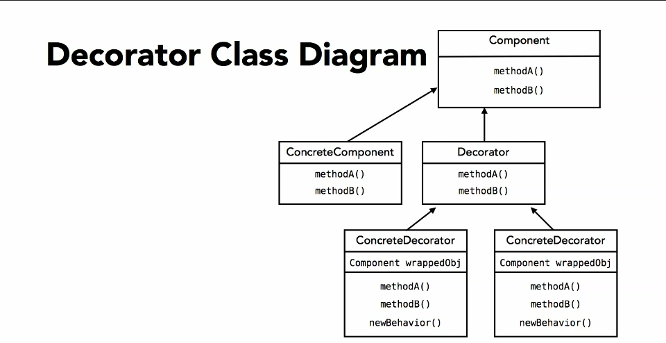
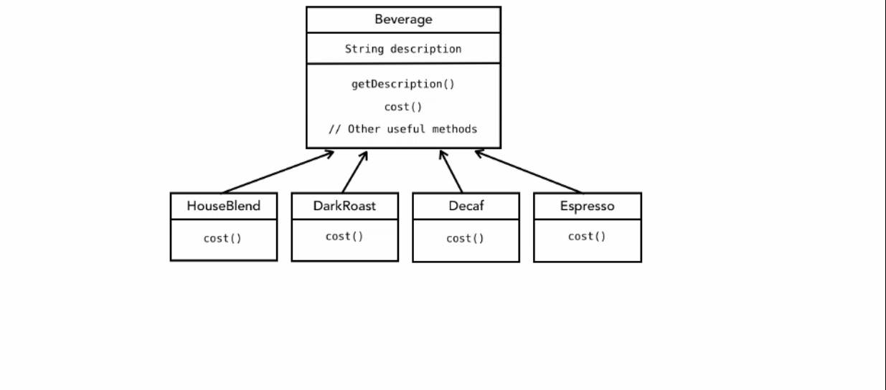
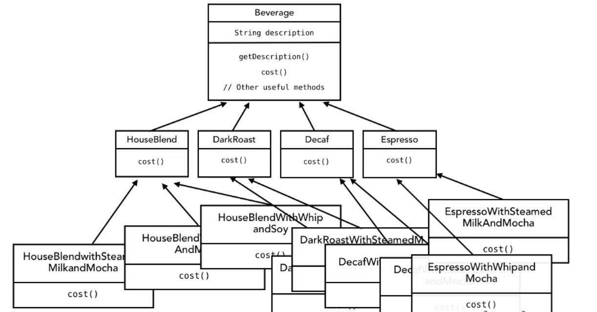

# Decorator 

The decorator pattern attached additional responsibilities 
to an object dynamically. Decorator provides a flexible
alternative to subclassing for extending functionality.

#### Scenario
suppose we want to have a beverage shop of coffee. We have 
different type of coffee.Each pricing is also different. Whenever 
we want to add different types of condiment in our coffee it's price will 
change.We can make sub classes of different condiments for beverage 
and then calculate the total cost there. 

When the type of beverages increases, classes will become messy like this
