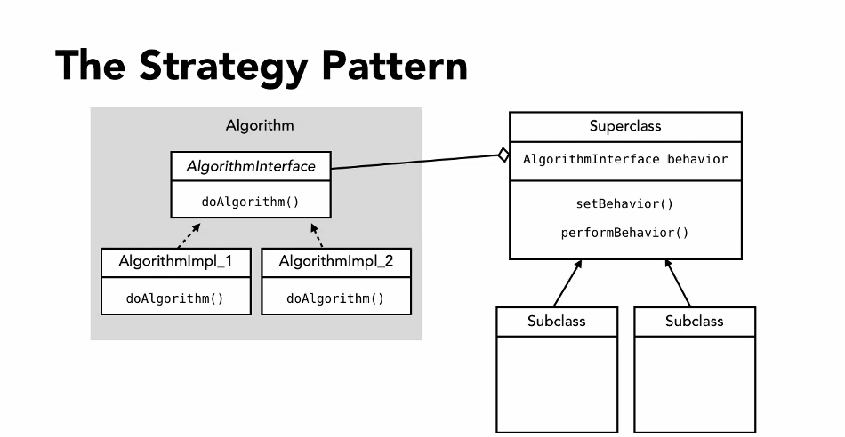

## Initially using inheritance

Suppose we want to make a duck simulator where 
we a duck class will help us to identity the behaviours
of a duck.We want to change the behaviour at runtime if 
possible.

So, we have use inheritance in our first approach where 
we have an abstract Duck having some common behaviour which are already implemented and an 
abstract method display.For example, MallardDuck extends the duck class and implemented the display. 
On the other hand RubberDuck override the fly and quake method on its own class.

So the problem is we have duplicated the methods by overriding and also 
destroy the reusable feature of OOP. For example RubberDuck and DecoyDuck 
can't fly and we have the same method implementation in both class. Let's see that if  interface
can solve this problem.

## Using interface and applying strategy

Here we have two interface FlyBeahvior and QuakeBehavior. Two class implements flyBehaviour and three 
class implements QuackBehavior interface. The abstract class 
duck has two class member flyBehaviour and quackBehavior. The Duck classes initiate 
this two member with their corresponding  behaviour implementations.

We have also behaviour setter to change the ducks behaviour at runtime by applying 
strategy.

Strategy Pattern defines a family of algorithms, 
encapsulates each one and makes them interchangeable.
Strategy lets the algorithm vary independently from 
clients that use it.